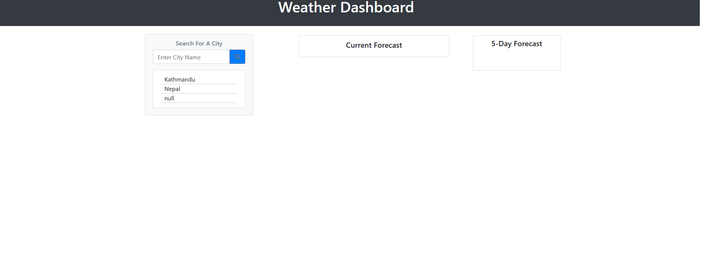
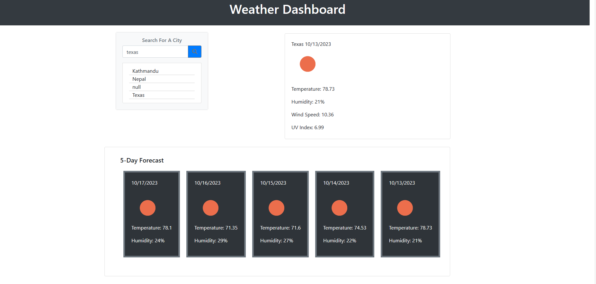
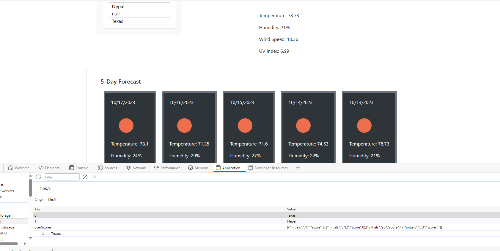

# Weather Dashboard

## Description

The Weather Dashboard is a simple, user-friendly application that allows users to search for current weather conditions and forecasts in cities worldwide. This tool is perfect for travelers, weather enthusiasts, or anyone who simply wants to know the weather forecast.

## Features

- Search for cities to see current weather conditions including temperature, humidity, wind speed, and UV index.
- View a 5-day weather forecast for the selected city.
- Previous search history is saved and can be easily accessed for future reference.

## Usage

Enter the name of the city in the search bar and click on the 'Search' button. The current weather conditions and a 5-day forecast for that city will be displayed. 

## Technologies
* HTML
* CSS

## Links 
[Github]

[live UrL]

## Screenshots

